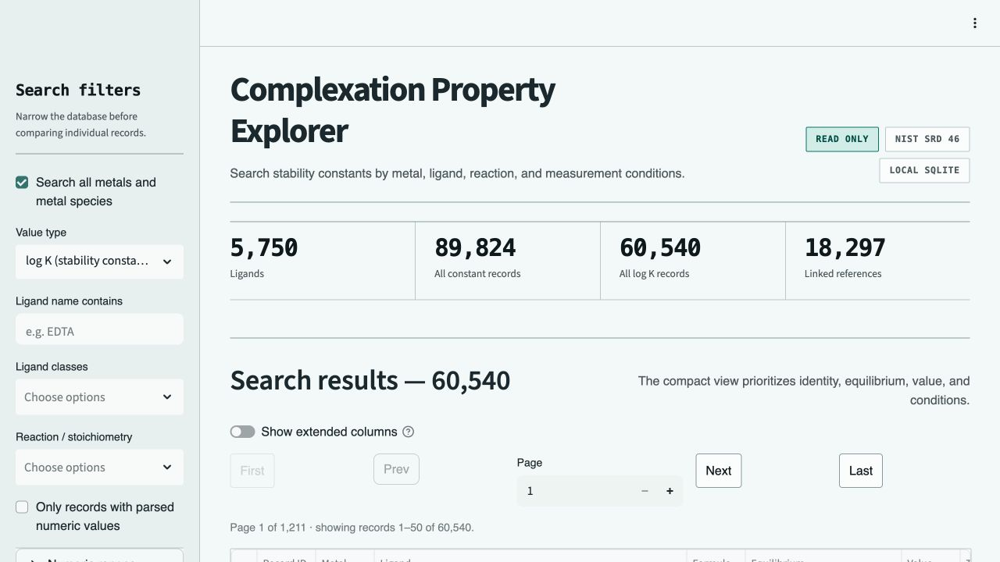
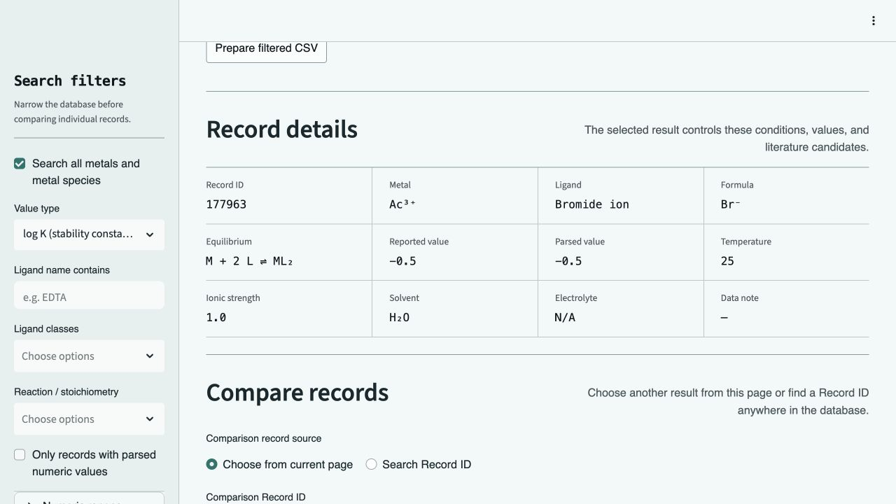

# Complexation Property Explorer

[](https://github.com/ccchaos12/complexation-property-explorer/actions/workflows/ci.yml)
[](https://www.python.org/)
[](LICENSE)

Complexation Property Explorer is a local, read-only research app for searching and
comparing metal–ligand stability constants. It converts NIST SRD 46 into a
reproducible SQLite database and exposes all available metal species through a
compact Streamlit interface.

The app is intended for coordination-chemistry researchers who need to move quickly
from a broad search to an interpretable record, its experimental conditions, and its
candidate literature references.



## What you can do

- Search all metals or selected oxidation states.
- Filter by ligand name, ligand class, value type, reaction stoichiometry, parsed
  value, temperature, and ionic strength.
- Browse 25–250 records per page and select a row to update the detail panel.
- Compare two records from the current page or by partial Record ID search.
- Read chemical formulae and equilibria as Unicode while preserving the original
  database text.
- Review ligand-plus-metal candidate references and their provenance limitation.
- Export up to 50,000 filtered records as UTF-8 CSV.
- Keep the source and canonical SQLite databases read-only during application use.



## Data at a glance

The included build reports describe the current SRD 46 conversion:

| Measure | Count |
|---|---:|
| Metal and metal-species records | 230 |
| Ligands | 5,750 |
| Constant and thermodynamic records | 89,824 |
| log K records | 60,540 |
| Linked reference records | 18,297 |

The NIST SQL package is a third-party extraction from the discontinued Windows
database. NIST does not warrant that extraction and notes known structure-data
errors. See [Data terms and citation](#data-terms-and-citation) before distributing
derived data.

## Requirements

- A 64-bit Windows, macOS, or Linux computer
- Python 3.11, 3.12, or 3.13
- Internet access during the first start for Python dependencies and the official
  NIST source package
- Approximately 350 MB of free space for the source archive, Python environment, and
  generated databases

The NIST archive and generated databases are deliberately excluded from Git. The
one-click launchers retrieve the original SQL archive directly from NIST and verify
its published SHA-256 checksum before any conversion begins.

The bundled Streamlit configuration listens only on `127.0.0.1` and disables
anonymous Streamlit usage statistics. The app and its SQLite database remain on the
computer where they are started.

## Step-by-step setup

### Windows — one-click setup

#### 1. Download and extract the project

On the GitHub repository page, select **Code → Download ZIP**, extract the download,
and move the extracted folder somewhere easy to find, for example:

```text
C:\ComplexationPropertyExplorer
```

Git users may instead run:

```powershell
git clone https://github.com/ccchaos12/complexation-property-explorer.git
cd complexation-property-explorer
```

#### 2. Install a supported Python version

Install Python 3.13 from the
[official Windows downloads page](https://www.python.org/downloads/windows/).
During installation, select **Add python.exe to PATH**.

Python 3.11 and 3.12 are also supported. You can confirm the installed versions in
Command Prompt or PowerShell:

```powershell
py --list
```

#### 3. Start the app

Double-click:

```text
start_windows.bat
```

Keep the terminal window open. On the first start, the launcher will:

1. find Python 3.11–3.13;
2. create the private `.venv` environment;
3. install the pinned dependencies;
4. download `SRD 46 SQL.zip` and the accompanying README directly from NIST;
5. verify both files against their published SHA-256 checksums;
6. convert the SQL archive to SQLite;
7. build the canonical read-only database;
8. start the local server; and
9. open the app automatically in the default browser.

The first start can take several minutes. Later, double-click the same
`start_windows.bat` file; completed download and database-build steps are validated
and reused. A damaged or incompatible generated database is preserved and rebuilt
automatically.

If the browser does not accept the automatic open request, use the `Ready:` address
shown in the terminal window—normally <http://localhost:8501>. If that port is busy,
the launcher selects the next available local port. Press `Ctrl+C` in the terminal
window to stop the app.

#### Windows manual setup

If you prefer to see every command, open PowerShell in the project folder and run:

```powershell
py -3.13 -m venv .venv
.\.venv\Scripts\python.exe -m pip install -r requirements-lock.txt
.\.venv\Scripts\python.exe -m scripts.prepare_app
.\.venv\Scripts\python.exe scripts\launch_app.py
```

Replace `3.13` with `3.12` or `3.11` if that is the supported version you installed.

### macOS — guided first start

#### 1. Install Python and extract the project

Install Python 3.13 from the
[official macOS downloads page](https://www.python.org/downloads/macos/). Python 3.11
and 3.12 are also supported.

Download the repository with **Code → Download ZIP**, then extract it. Git users may
instead run:

```bash
git clone https://github.com/ccchaos12/complexation-property-explorer.git
```

#### 2. Open the extracted project folder in Terminal

In Finder, right-click the extracted project folder and choose
**Services → New Terminal at Folder**. If that option is unavailable:

1. open **Terminal**;
2. type `cd `, including the trailing space;
3. drag the extracted project folder into the Terminal window; and
4. press Return.

#### 3. Start the app

Run:

```bash
chmod +x run.command run.sh
./run.command
```

The first start automatically creates the environment, downloads and verifies the
official NIST package, builds both SQLite databases, starts the app, and opens the
default browser. Existing generated databases are validated before reuse and rebuilt
automatically if damaged. Keep the Terminal window open. Press `Ctrl+C` to stop the
app.

Later, double-click `run.command` in Finder or run `./run.command` again. If macOS
blocks the first double-click, Control-click `run.command`, choose **Open**, and
confirm.

### Linux

```bash
git clone https://github.com/ccchaos12/complexation-property-explorer.git
cd complexation-property-explorer
./run.sh
```

The Linux launcher performs the same automatic preparation and browser-open flow.

## Using the app

1. Use the sidebar to search all metals or select specific metal species.
2. Add ligand, class, reaction, and numeric-range filters as needed.
3. Change **Records per page** for broader or more compact browsing.
4. Click a row in **Search results** to update **Record details**.
5. In **Compare records**, choose another page record or search a partial Record ID.
6. Review **Linked references** with the displayed ligand-plus-metal provenance
   limitation in mind.
7. Select **Prepare filtered CSV** when you need an export of the current query.

## Use another database

The default database is
`data/generated/stability_constants_canonical.db`. To use a separate compatible
database without changing code:

macOS or Linux:

```bash
COMPLEXATION_DB_PATH="/absolute/path/to/stability_constants_curated.db" ./run.sh
```

Windows PowerShell:

```powershell
$env:COMPLEXATION_DB_PATH = "C:\path\to\stability_constants_curated.db"
.\start_windows.bat
```

## Project structure

```text
app.py                    Streamlit application entry point
complexation_explorer/    Read-only queries, chemical formatting, and UI helpers
ingestion/                Source adapters and canonical schema
curation/                 Offline review and curated-database tools
publication/              Verified-only dataset release workflow
scripts/                  Official download, database preparation, and app launch tools
tests/                    Portable and full-data tests
data/                     Local raw/generated data and auditable build reports
docs/                     Development and data-source documentation
```

Before adding Excel or another source, read
[`docs/DATA_SOURCE_INTEGRATION.md`](docs/DATA_SOURCE_INTEGRATION.md). New sources must
retain their own identity, version, checksum, adapter version, and source record IDs.

## Development and tests

```bash
python -m pip install -r requirements-dev.txt
python -m unittest discover -s tests -v
python -m ruff check app.py complexation_explorer ingestion curation publication scripts tests
python -m compileall -q app.py complexation_explorer ingestion curation publication scripts tests
```

The portable suite creates a small two-source fixture at runtime, so CI does not need
the full NIST archive. Full SRD 46 count and integrity checks run when the generated
database is available locally. See [`docs/DEVELOPMENT.md`](docs/DEVELOPMENT.md) and
[`CONTRIBUTING.md`](CONTRIBUTING.md).

## Data and machine-learning boundary

The app does not read or modify the separate Excel workbook in the parent research
project. Future data enters through source-specific staging and review:

```text
immutable source → staging database → canonical database → curated database → frozen release
```

Machine-learning code should use an explicit frozen release rather than a mutable
working table. See [`publication/README.md`](publication/README.md).

## Data terms and citation

Please cite the initial data source as:

> Burgess, D. R. (2004), *NIST SRD 46. Critically Selected Stability Constants of
> Metal Complexes: Version 8.0 for Windows*, National Institute of Standards and
> Technology, [https://doi.org/10.18434/M32154](https://doi.org/10.18434/M32154)
> (accessed July 17, 2026).

NIST-derived data is not covered by this project's software license. See
[`DATA_NOTICE.md`](DATA_NOTICE.md) for the reuse terms, dated modification notice,
data-quality disclaimer, and release policy.

## Citing this software

GitHub can generate a software citation from [`CITATION.cff`](CITATION.cff). If a
publication relies on values from the included data workflow, cite both this software
and the underlying NIST dataset using the separate citation above.

## License and acknowledgments

The new Python application code is licensed under the [`MIT License`](LICENSE),
copyright 2026 ccchaos12 (Kexin Chen).

This project is a modern Python and Streamlit rewrite derived from Naoyuki Hatada's
original public-domain Stability Constant Explorer. See [`NOTICE.md`](NOTICE.md) for
application lineage and third-party notices.
